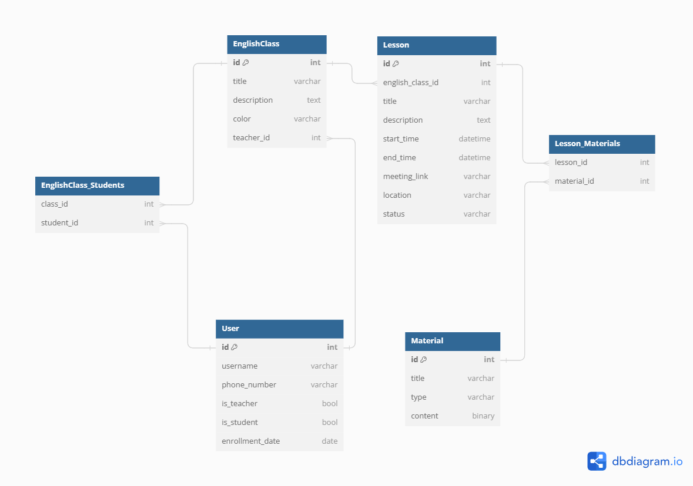
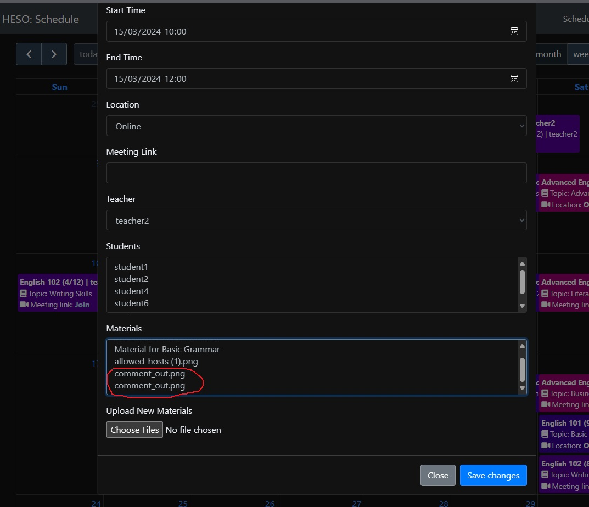
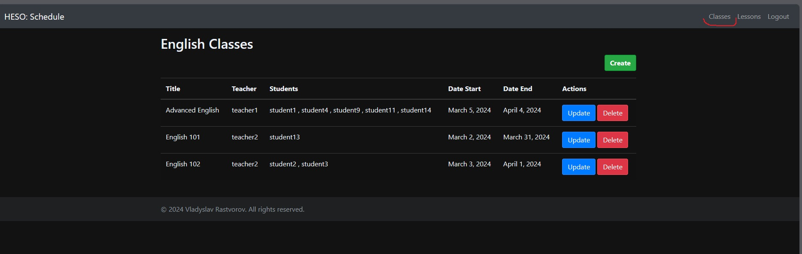
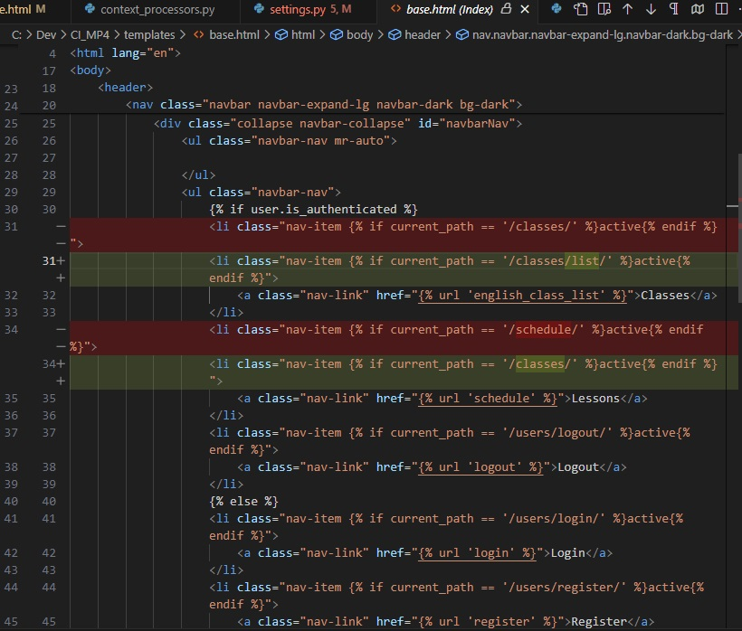
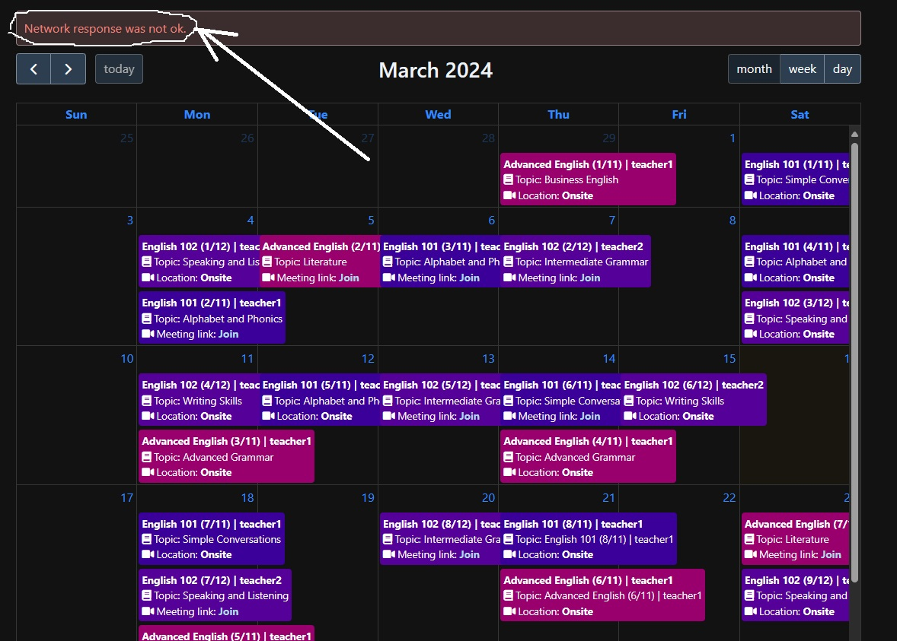
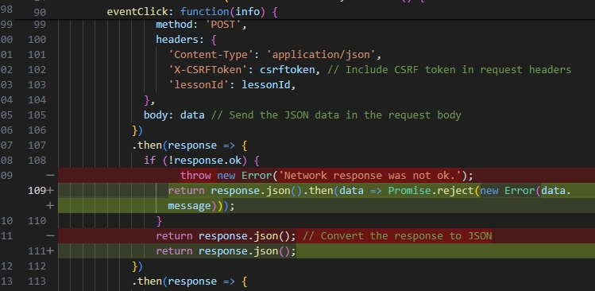
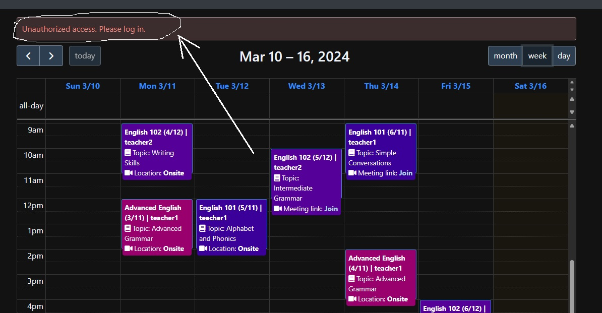

# HESO: Home English School Online – Online Class Schedule Service

[View the live project - Click here.](https://heso-cba8b8a64704.herokuapp.com/)

## Introduction

HESO is a streamlined online service designed for managing class schedules in small-scale English language schools. It features an admin section where students and teachers can interact with the class schedule.

## Table of Contents

- [Overview](#overview)
- [Usage](#usage)
- [User Roles and Responsibilities](#user-roles-and-responsibilities)
- [User Stories](#user-stories)
- [Model Relationships](#model-relationships)
- [System Features](#system-features)
- [Technologies Used](#technologies-used)
- [Agile Development Plan](#agile-development-plan)
- [Setup and Installation](#setup-and-installation)
- [Testing](#testing)
- [Contributing](#contributing)
- [License](#license)
- [Acknowledgments](#acknowledgments)

## Overview

HESO is tailored to facilitate the organization and management of class schedules, enhancing the efficiency of educational processes in online English language schools.


## Usage

1. **Class Schedule Accessibility**:
   - The class schedule is accessible to all users, whether they are registered or not.

2. **User Roles**:
   - **SuperAdmin**: Manages the website and user administration.
   - **Teacher**: Responsible for managing classes and lessons, as well as interacting with students.
   - **Student**: Can view class schedules.

3. **Access Rights**:
   - **SuperAdmin** has full access to all classes, lessons, and materials and can make changes to any of them.
   - **Teacher** has the right to manage the classes and lessons they are assigned to, as well as create new classes.
   - **Student** can view the general schedule of lessons and only has access to lessons available for their class.

4. **Registration and Role Assignment**:
   - SuperAdmin is created programmatically during project initialization.
   - When registering a new user, they are automatically assigned the role of Student.
   - The SuperAdmin can change a user's role from Student to Teacher in the administrative panel.

5. **Automatic Teacher Assignment**:
   - When a teacher creates a new class, they are automatically assigned as the teacher of that class.

6. **Teacher Rights**:
   - Teachers have full access to manage the classes and lessons they are assigned to, as well as the ability to create new classes.

7. **Student Rights**:
   - Students can only view the schedule of lessons and information about their assigned classes.

8. **Summary**:
    - SuperAdmin can CRUD all Classes, Lessons, Materials, and has access to admin panel for users managment.
    - Teachers can CRUD for Classes and Lessons for Classes they teach.
    - Students can only view Classes and Lessons for Classes they are enrolled in.
    - If the user does not have any of these roles, they are not allowed to view the Classes list and Lesson's details.


## User Stories

In the development of HESO, user stories are used to capture specific functionalities from the perspective of different users. These stories help in guiding the development process under Agile methodology.

### User Story for Admin
- **Story**: As an **Admin**, I can **manage user accounts and system settings** so that **the system remains secure and functions as intended**.
  - **Acceptance Criteria**:
    1. Admin can create, edit, and delete user accounts for teachers and students.
    2. Admin can access and modify system settings including platform features and access controls.
    3. Admin can CRUD class schedules and lesson plans to ensure accuracy and coherence.
    4. Admin can CRUD educational materials uploaded by teachers to maintain quality standards.

### User Story for Teacher
- **Story**: As a **Teacher**, I can **access and update the class schedule** so that **I can efficiently manage class timings and inform students of any changes**.
  - **Acceptance Criteria**:
    1. Teacher can CRUD their class schedules.
    2. Any changes made are automatically updated and visible to students.

### User Story for Student
- **Story**: As a **Student**, I can **view my class schedule** so that **I can keep track of class timings and any updates to the schedule**.
  - **Acceptance Criteria**:
    1. Student can access classes schedule.
    2. Schedule updates are immediately visible to the student.


## ERP diagram

This database schema outlines the structure of a system designed to manage classes, lessons, and materials for an educational institution. It includes **User** to record both teachers and students, **EnglishClass** for details of each class including its teacher and students, **Lesson** for specific class sessions with attributes such as timing and status, and **Material** for educational content. Junction tables **EnglishClass_Students** and **Lesson_Materials** support many-to-many relationships, allowing for the flexible association of students with classes and materials with lessons.

1. **HESO db diagram**:



2. **Project structure**:
    ```dbml

      Table User {
        id int [pk, increment] // primary key
        username varchar
        phone_number varchar [null]
        is_teacher bool
        is_student bool
        enrollment_date date [null]
      }

      Table EnglishClass {
        id int [pk, increment]
        title varchar
        description text
        color varchar
        teacher_id int [ref: > User.id] // foreign key
      }

      Table Lesson {
        id int [pk, increment]
        english_class_id int [ref: > EnglishClass.id]
        title varchar
        description text [null]
        start_time datetime
        end_time datetime
        meeting_link varchar [null]
        location varchar
        status varchar
      }

      Table Material {
        id int [pk, increment]
        title varchar
        type varchar
        content binary [null]
      }

      // Relationships
      Table EnglishClass_Students {
        class_id int [ref: > EnglishClass.id]
        student_id int [ref: > User.id]
      }

      Table Lesson_Materials {
        lesson_id int [ref: > Lesson.id]
        material_id int [ref: > Material.id]
      }

    ```

## System Features

- **Class Schedule Management**: Teachers and students can view and interact with class schedules. Teachers can manage EnglishClass, Lessons and Materials.
- **Admin Control**: System administrators can manage schedule and user accounts and configure system settings.


## Future Enhancements

- Google Calendar API Integration:

  **Automated Scheduling**: Class schedules are automatically synchronized with Google Calendar, offering a seamless integration for managing class timings.

  **Real-time Updates**: Teachers and students receive real-time updates and notifications through Google Calendar.

## Technologies Used
- **Backend**: Django 4.2.9
- **Frontend**: Bootstrap 4.6.2, jQuery 3.5.1, FullCalendar 6.1.10
- **Database**: PostgreSQL 13.9
- **Version Control**: Git, GitHub
- **Deployment**: Heroku

## Agile Development Plan

The development of HESO is structured into sprints, with each sprint targeting specific tasks for a focused and incremental development approach. Below is the sprint schedule along with their respective tasks:

### Sprint Schedule

#### Sprint 1 (28/01/2024 - 31/01/2024): Project Setup and Basic Backend
- Task 1: Set up the Django project and configure the development environment.
- Task 2: Establish database models for User, Teacher, Student, and Admin.
- Task 3: Implement a basic user authentication system.

#### Sprint 2 (01/02/2024 - 04/02/2024): Basic Frontend and User Management
- Task 4: Set up the basic structure of the frontend using Bootstrap and jQuery.
- Task 5: Implement frontend interfaces for user registration and login.
- Task 6: Develop Admin functionalities for managing user accounts.

#### Sprint 3 (05/02/2024 - 08/02/2024): Advanced Backend for Class and Schedule Management
- Task 7: Develop models and backend functionalities for EnglishClass and Schedule.
- Task 8: Implement Admin tools for class schedules and lesson plan management.

#### Sprint 4 (09/02/2024 - 12/02/2024): Frontend for Class and Schedule Management
- Task 9: Create frontend interfaces for class schedule viewing and editing.
- Task 10: Enable Teachers to modify class schedules through the frontend.

#### Sprint 5 (13/02/2024 - 16/02/2024): Lesson and Material Management
- Task 11: Develop models and backend functionalities for Lesson and Material.
- Task 12: Build Admin CRUD system for educational materials.

#### Sprint 6 (17/02/2024 - 20/02/2024): Frontend Integration and Notification System
- Task 13: Develop frontend integration for schedule features.
- Task 14: Implement a notification system for schedule changes and upcoming classes.

#### Sprint 7 (21/02/2024 - 24/02/2024): Testing and Refinement
- Task 15: Conduct thorough unit and integration tests.
- Task 16: Refine user interfaces and functionalities based on feedback.

#### Sprint 8 (25/02/2024 - 28/02/2024): Documentation and Final Testing
- Task 17: Document the code.
- Task 18: Conduct user acceptance testing and finalize bug fixes.

#### Sprint 9 (29/02/2024 - 03/03/2024): Deployment and Launch
- Task 19: Set up the PostgreSQL production database.
- Task 20: Configure continuous integration and deployment pipelines.
- Task 21: Deploy the project on a hosting platform like Heroku.

#### Sprint 10 (04/03/2024 - 19/03/2024): Enhancements and Final Touches
- Task 22: Conduct final security and performance checks.
- Task 23: Implement last-minute refinements and fixes based on testing.
- Task 24: Prepare for final release including updating documentation and enhancing user experience.

Each sprint in this schedule is a focused development cycle that addresses specific components of the project, facilitating clear progression towards the project goals.

## Setup and Installation

### Step 1: Install Project Dependencies

1. Ensure you have Python 3.x installed.
2. Install the required dependencies from the `requirements.txt` file by executing the following command in the project's root directory:

    ```bash
    pip install -r requirements.txt
    ```

### Step 2: Configure the Database

Configure the connection to the PostgreSQL database in the `settings.py` file of your Django project.

### Step 3: Apply Migrations

* Apply migrations to create the database tables by running the following command:

    ```bash
    python manage.py migrate
    ```

### Step 4: Run the Server

* Start the Django development server by running the following command:

    ```bash
    python manage.py runserver
    ```

### Step 5: Populate Data

1. To populate the database with dummy data, execute the `populate_data.py` script using the `python manage.py shell` command:

    ```bash
    python manage.py shell
    ```
2. Run the `populate_data.py` script in the Django interactive shell:

    ```python
    exec(open('populate_data.py').read())
    ```
3. **Note:** Upon initialization, **SuperAdmin** is created with the password:

    ```bash
     heso_password
    ```

    Other users, like **teacher1**, **teacher2**, **student1**...**student10** are created, all with the password:

    ```bash
     password123
    ```

### Step 6: Clean Database (Optional)

1. You can clean the database at any time using the following command:

    ```bash
    python manage.py flush
    ```

2. After cleaning the database, follow steps 1-2 to set up the database again.

### Step 7: Start with an Empty Database (Optional)

1. If you prefer not to use the `populate_data.py` script and start with an empty database, you can create a Superuser by running the command:

    ```bash
    python manage.py createsuperuser
    ```

2. Follow the prompts to create a superuser, including providing a username, email address, and password.


## Testing

### Send emails

- For test sending mails feature in project using mailtrap.io service. Please, use credentials below to look ones:

 ```bash
 mailtrap link: https://mailtrap.io/inboxes/2689731/messages/4092718424
 mailtrap login: vlad.rastvorov@aol.com
 mailtrap password: :8xt:XP4fWr.mwe
 ```

### Unit tests for Users App

#### User Registration Form Test
- `test_form_valid`: Test that the user registration form is valid with correct data.
- `test_form_invalid`: Test that the user registration form is invalid with incorrect data.

#### User Registration Test
- `test_registration_page_status_code`: Test that the registration page returns a status code of 200.
- `test_registration_form`: Test that user registration is successful and an email is sent upon registration.

#### Logout Test
- `test_logout_redirect`: Test that logout redirects to the login page.

#### Login Test
- `test_login_page_status_code`: Test that the login page returns a status code of 200.
- `test_login_form_valid`: Test that login with valid credentials redirects to the expected page.

### Unit tests for Scheduling App

#### Schedule View Tests
- `test_schedule_view_for_anonymous_user`: Test that the schedule view is accessible to anonymous users.
- `test_schedule_view_for_student`: Test that the schedule view is accessible to students.
- `test_english_class_creation_by_teacher`: Test that teachers can create English classes.
- `test_english_class_creation_by_student`: Test that students are redirected when trying to create English classes.
- `test_update_english_class_by_teacher`: Test that teachers can update English classes.
- `test_delete_english_class_by_super_user`: Test that superusers can delete English classes.
- `test_lesson_details_access_by_teacher`: Test that teachers can access lesson details.
- `test_lesson_details_access_by_student`: Test that students can access lesson details.
- `test_lesson_details_access_by_anonymous_user`: Test that anonymous users cannot access lesson details.


## Bugs

### 1. Doubling while saving new material

- **Description:** When we add new material in the upload form, in the list of lesson materials we see double titles of ones.

  

- **Solution:** Using the get_or_create method on the backend, which allows you to get an existing material or create a new one if it doesn't exist.

  ```bash
  # Update materials if provided
  if 'materials' in data:
      material_ids = data['materials']
      lesson.materials.clear()
      lesson.materials.set(Material.objects.filter(id__in=material_ids))
  
  if request.FILES.getlist('new_materials'):
      for uploaded_file in request.FILES.getlist('new_materials'):
          if uploaded_file:
              material, created = Material.objects.get_or_create(
                  title=uploaded_file.name,
                  type="file",
                  content=uploaded_file.read()
              )
              if created:
                  lesson.materials.add(material)
  
  lesson.save()
  ```
  ### 2. Don't highlight current menu item

- **Description:** When the user clicks on a menu item that doesn't have an active class (highlighted in bold white).

  

- **Solution:** Need accurate writing of the URL to use for comparisons.

 

  ### 3. Incorrect message for unauthorised user actions

- **Description:** Incorrect message when non-authorised user clicks on website items.

  

- **Solution:** Change JavaScript handler for these situations.

 

 - **Result:** Correct message (from server).

 


## Contributing
- Information for developers interested in contributing to the HESO project.

## License
- Details about the licensing terms for the project.

## Acknowledgments
- A thank you to all the contributors, testers, and supporters who have helped in the development of HESO.
