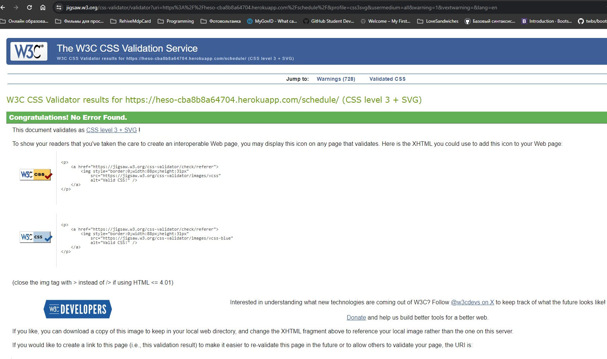

# HESO: Home English School Online – Online Class Schedule Service

[View the live project - Click here.](https://heso-cba8b8a64704.herokuapp.com/)

## Introduction

HESO is a streamlined online service designed for managing class schedules in small-scale English language schools. It features an admin section where students and teachers can interact with the class schedule.

## Table of Contents

- [Overview](#overview)
- [Usage](#usage)
- [User Stories](#user-stories)
- [ERP diagram](#erp-diagram)
- [System Features](#system-features)
- [Future Enhancements](#future-enhancements)
- [Technologies Used](#technologies-used)
- [Agile Development Plan](#agile-development-plan)
- [Setup and Installation](#setup-and-installation)
- [Testing and validation](#testing-and-validation)
- [Bugs](#bugs)
- [Deployment](#deployment)
- [Contributing](#contributing)
- [License](#license)
- [Acknowledgments](#acknowledgments)

## Overview

HESO is tailored to facilitate the organization and management of class schedules, enhancing the efficiency of educational processes in online English language schools.


## Usage

1. **Class Schedule Accessibility**:
   - The class schedule is accessible to all users, whether they are registered or not.

2. **User Roles**:
   - **SuperAdmin**: Manages the website and user administration.
   - **Teacher**: Responsible for managing classes and lessons, as well as interacting with students.
   - **Student**: Can view class schedules.

3. **Access Rights**:
   - **SuperAdmin** has full access to all classes, lessons, and materials and can make changes to any of them.
   - **Teacher** has the right to manage the classes and lessons they are assigned to, as well as create new classes.
   - **Student** can view the general schedule of lessons and only has access to lessons available for their class.

4. **Registration and Role Assignment**:
   - SuperAdmin is created programmatically during project initialization.
   - When registering a new user, they are automatically assigned the role of Student.
   - The SuperAdmin can change a user's role from Student to Teacher in the administrative panel.

5. **Automatic Teacher Assignment**:
   - When a teacher creates a new class, they are automatically assigned as the teacher of that class.

6. **Teacher Rights**:
   - Teachers have full access to manage the classes and lessons they are assigned to, as well as the ability to create new classes.

7. **Student Rights**:
   - Students can only view the schedule of lessons and information about their assigned classes.

8. The procedure of the **Assigning roles** in the system:
    - SuperAdmin is assigned programmatically, using:
      ```bash
      python manage.py creatsuperuser
      ```
    - Any new user who registers on the site gets the role of Student by default.
    - SuperAdmin, through the admin panel (/admin), can make any Student a Teacher, or vice versa.

9. **Summary**:
    - SuperAdmin can CRUD all Classes, Lessons, Materials, and has access to admin panel for users managment.
    - Teachers can CRUD for Classes and Lessons for Classes they teach.
    - Students can only view Classes and Lessons for Classes they are enrolled in.
    - If the user does not have any of these roles, they are not allowed to view the Classes list and Lesson's details.

[Back to Table of Contents](#table-of-contents)

## User Stories

In the development of HESO, user stories are used to capture specific functionalities from the perspective of different users. These stories help in guiding the development process under Agile methodology.

### User Story for Admin
- **Story**: As an **Admin**, I can **manage user accounts and system settings** so that **the system remains secure and functions as intended**.
  - **Acceptance Criteria**:
    1. Admin can create, edit, and delete user accounts for teachers and students.
    2. Admin can access and modify system settings including platform features and access controls.
    3. Admin can CRUD class schedules and lesson plans to ensure accuracy and coherence.
    4. Admin can CRUD educational materials uploaded by teachers to maintain quality standards.

### User Story for Teacher
- **Story**: As a **Teacher**, I can **access and update the class schedule** so that **I can efficiently manage class timings and inform students of any changes**.
  - **Acceptance Criteria**:
    1. Teacher can CRUD their class schedules.
    2. Teachers can CRUD educational materials for lessons in the class they are teaching.
    3. Any changes made are automatically updated and visible to students.

### User Story for Student
- **Story**: As a **Student**, I can **view my class schedule** so that **I can keep track of class timings and any updates to the schedule**.
  - **Acceptance Criteria**:
    1. Student can view classes and lessons schedule where he is enrolled.
    2. Schedule updates are immediately visible to the student.

[Back to Table of Contents](#table-of-contents)

## ERP diagram

This database schema outlines the structure of a system designed to manage classes, lessons, and materials for an educational institution. It includes **User** to record both teachers and students, **EnglishClass** for details of each class including its teacher and students, **Lesson** for specific class sessions with attributes such as timing and status, and **Material** for educational content. Junction tables **EnglishClass_Students** and **Lesson_Materials** support many-to-many relationships, allowing for the flexible association of students with classes and materials with lessons.

1. **HESO db diagram**:


2. **Project structure**:
    ```dbml

      Table User {
        id int [pk, increment] // primary key
        username varchar
        phone_number varchar [null]
        is_teacher bool
        is_student bool
        enrollment_date date [null]
      }

      Table EnglishClass {
        id int [pk, increment]
        title varchar
        description text
        color varchar
        teacher_id int [ref: > User.id] // foreign key
      }

      Table Lesson {
        id int [pk, increment]
        english_class_id int [ref: > EnglishClass.id]
        title varchar
        description text [null]
        start_time datetime
        end_time datetime
        meeting_link varchar [null]
        location varchar
        status varchar
      }

      Table Material {
        id int [pk, increment]
        title varchar
        type varchar
        content binary [null]
      }

      // Relationships
      Table EnglishClass_Students {
        class_id int [ref: > EnglishClass.id]
        student_id int [ref: > User.id]
      }

      Table Lesson_Materials {
        lesson_id int [ref: > Lesson.id]
        material_id int [ref: > Material.id]
      }

    ```

[Back to Table of Contents](#table-of-contents)

## System Features

- **Class Schedule Management**: Teachers and students can view and interact with class schedules. Teachers can manage EnglishClass, Lessons and Materials.
- **Admin Control**: System administrators can manage schedule and user accounts and configure system settings.
- **Changing Lesson Dates Drag-and-Drop**: The SuperAdmin for all lessons and teachers for lessons where they are teacher in ``/schedule`` for month, week or day can change lesson dates using drag and drop only:


## Future Enhancements

- Google Calendar API Integration:

  **Automated Scheduling**: Class schedules are automatically synchronized with Google Calendar, offering a seamless integration for managing class timings.

  **Real-time Updates**: Teachers and students receive real-time updates and notifications through Google Calendar.

## Technologies Used

- **Backend**: Python 3.12.*, Django 4.2.9
- **Frontend**: Bootstrap 4.6.2, jQuery 3.5.1, FullCalendar 6.1.10
- **Database**: PostgreSQL 13.9
- **Version Control**: Git, GitHub
- **Deployment**: Heroku

[Back to Table of Contents](#table-of-contents)

## Agile Development Plan

The development of HESO is structured into sprints, with each sprint targeting specific tasks for a focused and incremental development approach. Below is the sprint schedule along with their respective tasks.

``Current version of Agile plane`` by [link](https://github.com/users/vladar21/projects/7)

### Sprint Schedule

#### Sprint 1 (28/01/2024 - 31/01/2024): Project Setup and Basic Backend
- Task 1: Set up the Django project and configure the development environment.
- Task 2: Establish database models for User, Teacher, Student, and Admin.
- Task 3: Implement a basic user authentication system.

#### Sprint 2 (01/02/2024 - 04/02/2024): Basic Frontend and User Management
- Task 4: Set up the basic structure of the frontend using Bootstrap and jQuery.
- Task 5: Implement frontend interfaces for user registration and login.
- Task 6: Develop Admin functionalities for managing user accounts.

#### Sprint 3 (05/02/2024 - 08/02/2024): Advanced Backend for Class and Schedule Management
- Task 7: Develop models and backend functionalities for EnglishClass and Schedule.
- Task 8: Implement Admin tools for class schedules and lesson plan management.

#### Sprint 4 (09/02/2024 - 12/02/2024): Frontend for Class and Schedule Management
- Task 9: Create frontend interfaces for class schedule viewing and editing.
- Task 10: Implement FullCalendar tools for class schedules and lesson plan management.

#### Sprint 5 (13/02/2024 - 16/02/2024): Lesson and Material Management
- Task 11: Develop models and backend functionalities for Lesson and Material.
- Task 12: Build Admin CRUD system for educational materials.

#### Sprint 6 (17/02/2024 - 20/02/2024): Frontend Integration and Notification System
- Task 13: Develop frontend integration for schedule features.
- Task 14: Implement a notification system for schedule changes and upcoming classes.

#### Sprint 7 (21/02/2024 - 24/02/2024): Testing and Refinement
- Task 15: Conduct thorough unit and integration tests.
- Task 16: Refine user interfaces and functionalities based on feedback.

#### Sprint 8 (25/02/2024 - 28/02/2024): Documentation and Final Testing
- Task 17: Document the code.
- Task 18: Conduct user acceptance testing and finalize bug fixes.

#### Sprint 9 (29/02/2024 - 03/03/2024): Deployment and Launch
- Task 19: Set up the PostgreSQL production database.
- Task 20: Configure continuous integration and deployment pipelines.
- Task 21: Deploy the project on a hosting platform like Heroku.

#### Sprint 10 (04/03/2024 - 19/03/2024): Enhancements and Final Touches
- Task 22: Conduct final security and performance checks.
- Task 23: Implement last-minute refinements and fixes based on testing.
- Task 24: Prepare for final release including updating documentation and enhancing user experience.

Each sprint in this schedule is a focused development cycle that addresses specific components of the project, facilitating clear progression towards the project goals.

[Back to Table of Contents](#table-of-contents)

## Clone, Setup and Installation

### Step 1: Clone the Repository Code Locally
To clone the repository and run HESO: Home English School Online – Online Class Schedule Service locally on your machine, follow these steps:

**Prerequisites**

Before you begin, make sure you have the following installed:
- Git
- A text editor or an IDE (like Visual Studio Code, PyCharm, etc.)

Cloning the Repository:
1. ``Open Terminal``: Open your terminal, command prompt, or Git bash in the directory where you wish to clone the repository.

2. ``Clone the Repository``: Use the following Git command to clone the repository:

```bash
git clone https://github.com/vladar21/heso.git
```
Replace https://github.com/vladar21/heso.git with the actual repository URL.

3. ``Navigate to the Repository Directory``: Once the repository has been cloned, navigate to the cloned repository directory:

```bash
cd heso
```

### Step 2: Install Project Dependencies

1. Ensure you have Python 3.12.x installed.
2. Install the required dependencies from the `requirements.txt` file by executing the following command in the project's root directory:

    ```bash
    pip install -r requirements.txt
    ```

### Step 3: Configure the Database

Configure the connection to the PostgreSQL database in the `settings.py` file of your Django project.

### Step 4: Apply Migrations

* Apply migrations to create the database tables by running the following command:

    ```bash
    python manage.py migrate
    ```

### Step 5: Run the Server

* Start the Django development server by running the following command:

    ```bash
    python manage.py runserver
    ```

### Step 6: Populate Data

1. To populate the database with dummy data, execute the `populate_data.py` script using the `python manage.py shell` command:

    ```bash
    python manage.py shell
    ```
2. Run the `populate_data.py` script in the Django interactive shell:

    ```python
    exec(open('populate_data.py').read())
    ```
3. **Note:** Upon initialization, **SuperAdmin** is created with the password:

    ```bash
     heso_password
    ```

    Other users, like **teacher1**, **teacher2**, **student1**...**student10** are created, all with the password:

    ```bash
     password123
    ```

### Step 7: Clean Database (Optional)

1. You can clean the database at any time using the following command:

    ```bash
    python manage.py flush
    ```

2. After cleaning the database, follow steps 2-3 to set up the database again.

### Step 8: Start with an Empty Database (Optional)

1. If you prefer not to use the `populate_data.py` script and start with an empty database, you can create a Superuser by running the command:

    ```bash
    python manage.py createsuperuser
    ```

2. Follow the prompts to create a superuser, including providing a username, email address, and password.

[Back to Table of Contents](#table-of-contents)

## Testing and validation

### Flake8 validation

- The project code has passed the Flake8 validation outcome.


### Send emails

- For check sending mails feature in project using mailtrap.io service. Please, use credentials below to look ones:

 ```bash
 mailtrap link: https://mailtrap.io/inboxes/2689731/messages/4092718424
 mailtrap login: vlad.rastvorov@aol.com
 mailtrap password: :8xt:XP4fWr.mwe
 ```

### Unit Tests Suite Overview

- Our test suite ensures the robustness and functionality of user management and scheduling within the application. Tests are categorized by focus areas for clarity.

#### User Management Tests
- `User Registration Validation`: Tests validate the user registration form with correct and incorrect inputs, ensuring only valid data passes.
- `Duplicate Registration Handling`: Confirms the system prevents users from registering with a username or email that already exists.
- `Password Strength Enforcement`: Verifies that user registration rejects common and easily guessable passwords to enhance security.
- `User Logout Process`: Tests the logout functionality, ensuring users are properly logged out and redirected.
- `Authenticated Redirection`: Verifies that authenticated users are redirected from the login and registration pages to prevent redundant registrations or logins.

#### Scheduling System Tests
- `Access Control`: Ensures that only authorized roles (e.g., teachers, students) can access specific scheduling functionalities like viewing schedules, creating classes, or updating lessons.
- `Class and Lesson Management`: Tests the creation, updating, and deletion of classes and lessons by authorized users, ensuring the application correctly handles these operations.
- `Lesson Details Accessibility`: Confirms that lesson details are accessible to users with the appropriate permissions, including teachers and enrolled students.
- `Scheduling Views`: Validates that the scheduling views render correctly for different user roles, providing the necessary information as expected.

#### Running Unit Tests

To run the unit tests in the project, execute the following commands:

```bash
python manage.py test --settings=heso.settings_test
```

Our example of Successful Test Execution


#### The W3C Markup Validator, and W3C CSS Validator, and JSHint Javascript Validator Services

- All of these services were used to validate pages of the project to ensure there were no syntax errors in the project.

-   [W3C Markup Validator](https://validator.w3.org/nu/) - [results link](https://validator.w3.org/nu/?doc=https%3A%2F%2Fheso-cba8b8a64704.herokuapp.com%2Fschedule%2F)

See the W3C Markup validation **Results** in the image below:


-   [W3C CSS Validator](https://jigsaw.w3.org/css-validator/#validate_by_input) - [results link](https://jigsaw.w3.org/css-validator/validator?uri=https%3A%2F%2Fheso-cba8b8a64704.herokuapp.com%2Fschedule%2F&profile=css3svg&usermedium=all&warning=1&vextwarning=&lang=en)

See the W3C CSS validation **Results** in the image below:



-   [JSHint JavaScript Validator](https://jshint.com/)

See the JSHint validation **Results** in the image below:


#### Accessibility

1. I confirmed that the colors and fonts chosen are easy to read and accessible by running it through lighthouse in devtools.

- Lighthouse Chrome devtool test results:


- The main problem with performance and SEO - it is CDN factor.


2. I tested that this page works in different browsers: Chrome, Firefox, Mircrosoft Edge.

3. I confirmed that this project is responsive, looks good and functions on all standard screen sizes using the devtools device toolbar.

4. I have confirmed that the form works: requires entries in every field, will only accept an email in the email field, and the submit button works.

[Back to Table of Contents](#table-of-contents)

## Bugs

### 1. Doubling while saving new material

- **Description:** When we add new material in the upload form, in the list of lesson materials we see double titles of ones.

  

- **Solution:** Using the get_or_create method on the backend, which allows you to get an existing material or create a new one if it doesn't exist.

  ```bash
  # Update materials if provided
  if 'materials' in data:
      material_ids = data['materials']
      lesson.materials.clear()
      lesson.materials.set(Material.objects.filter(id__in=material_ids))
  
  if request.FILES.getlist('new_materials'):
      for uploaded_file in request.FILES.getlist('new_materials'):
          if uploaded_file:
              material, created = Material.objects.get_or_create(
                  title=uploaded_file.name,
                  type="file",
                  content=uploaded_file.read()
              )
              if created:
                  lesson.materials.add(material)
  
  lesson.save()
  ```
  ### 2. Don't highlight current menu item

- **Description:** When the user clicks on a menu item that doesn't have an active class (highlighted in bold white).

  

- **Solution:** Need accurate writing of the URL to use for comparisons.

 

  ### 3. Incorrect message for unauthorised user actions

- **Description:** Incorrect message when non-authorised user clicks on website items.

  

- **Solution:** Change JavaScript handler for these situations.

 

 - **Result:** Correct message (from server).

 

[Back to Table of Contents](#table-of-contents)

## Deployment

### Version Control

The development process utilizes Git for version control, with regular commits and descriptive messages to track changes and facilitate collaboration.

### Heroku Deployment

Heroku is a cloud platform that allows developers to build, run, and operate applications entirely in the cloud. Follow the instructions below to deploy your HESO: Home English School Online – Online Class Schedule Service on Heroku:

Prerequisites
- A Heroku account – Sign up here if you don't have one.
- The Heroku CLI – Download and install it from here.
- Git installed on your machine.

Steps for Deployment
1. Login to Heroku: After installing the Heroku CLI, open your terminal and log in to your Heroku account:

```bash
heroku login
```
Your web browser will open for you to log in to your Heroku account.

2. Create a Heroku App: Create a new app on Heroku:

```bash
heroku create your-app-name
```
Replace your-app-name with a unique name for your application. Heroku will provide you with a web URL and a git URL for deployment.

3. Prepare Your Application: Make sure your application is configured correctly for deployment on Heroku.

4. Commit to Git: If you’ve made any changes, commit them to your git repository:

```bash
git add .
git commit -m "Added files for Heroku deployment"
```

5. Deploy to Heroku: Deploy your code to Heroku:

```bash
git push heroku main
```
Heroku will now receive your code and start building your app using the necessary buildpacks.

6. Ensure at Least One Instance of the App is Running:

```bash
heroku ps:scale web=1 --app your-app-name
```
This command tells Heroku to run a single instance of your web app.

7. Open Your Application: You can now open your app in the browser:

```bash
heroku open --app your-app-name
```
Alternatively, you can visit the URL provided by Heroku in step 2.

[Back to Table of Contents](#table-of-contents)

## Contributing

If you want to contribute to the project's development, please adhere to the following guidelines:

1. Fork the repository.
2. Clone your forked version of the repository.
3. Create a new branch for your feature or fix.
4. Make your changes and commit them with descriptive commit messages.
5. Push the changes to your fork.
6. Open a pull request to the original repository.

Please ensure you adhere to the contribution guidelines provided by the repository owner.

## License

- This project is licensed under the MIT License.

## Acknowledgments

- My sister - Eleonora Rastvorova - for inspiration.

- My Mentor - Oluwafemi Medale - for continuous helpful feedback.

- My Cohort Facilitator - Marko Tot - for the timely and great advice.

- Tutor support at Code Institute for their support.

[Back to Table of Contents](#table-of-contents)